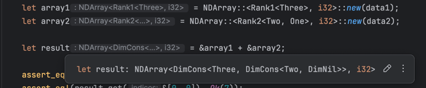

# Flugrost: NDArrays with typed shapes _and broadcasting_


## Motivation

Numpy arrays carry their shape as runtime data.  When two arrays have
incompatible shapes, users discover the problem only when the program runs.
Broadcasting rules are also evaluated at runtime.  Flugrost experiments with
representing these shapes as types so that broadcasting and indexing can be
checked by the compiler.  The goal is to catch the same shape errors that would
normally surface in Python code, but at compile time.

## Type level numbers

Rust does have const generics for integers, but it is currently impossible to
derive new compile-time constants from them inside the type system.  In order to
decide whether two dimensions can broadcast we need to compare and manipulate
numbers at the type level.  For that reason this project defines its own small
hierarchy of natural numbers.  `Zero` and the successor type `Succ<N>` expose
their value through the `Nat` trait:

```rust
pub struct Zero;
pub struct Succ<N>(core::marker::PhantomData<N>);

pub trait Nat {
    const VALUE: usize;
}
```

Higher numbers are created via type aliases such as `Two` or `Three` which are
just nested applications of `Succ`.

## Shapes as linked lists

A shape may contain an arbitrary number of dimensions.  Using tuples or arrays
as type parameters would require a separate trait implementation for every
possible rank.  To allow generic recursion over the dimensions the project
represents shapes as a type-level linked list.  The list is built from right to
left where the last type parameter denotes the leading dimension:

```rust
pub struct DimNil;

pub struct DimCons<Head, Tail>(core::marker::PhantomData<(Head, Tail)>);

pub type Rank1<D0> = DimCons<D0, DimNil>;
pub type Rank2<D0, D1> = DimCons<D1, Rank1<D0>>;
```

The `Shape` trait then computes meta information like `RANK` and
`N_ELEMENTS` and provides helpers to translate between multi dimensional indices
and flat offsets.

## Compile time broadcasting

Numpy style broadcasting is expressed purely in the type system.  Two shapes can
be combined through the `Broadcast` trait which recursively evaluates the rules
for each dimension.  Single dimensions are handled by `BroadcastOneDim` and only
allow either equality or broadcasting from `1`:

```rust
pub trait BroadcastOneDim<Rhs> {
    type Output: Nat;
}

impl<D: GreaterThanZero> BroadcastOneDim<D> for One { type Output = D; }
impl<D: GreaterThanZero> BroadcastOneDim<One> for D { type Output = D; }
impl<D: Nat>              BroadcastOneDim<D> for D   { type Output = D; }
```

Larger shapes build on this to compute a new `Output` shape at compile time.

## The `NDArray` type

`NDArray<S, T>` stores the actual data alongside a phantom marker for its shape.
The constructor checks that the provided buffer matches the expected compile time
size.  Indexing and broadcasting rely on the `Shape` and `Broadcast` machinery:

```rust
pub struct NDArray<S: Shape, T> {
    data: Vec<T>,
    shape_marker: std::marker::PhantomData<S>,
}
```

The `broadcast` method uses the compile time result of `Broadcast` to create a
new array with the desired shape.

Element wise operations such as addition or multiplication are provided via a
macro that performs broadcasting of both operands before applying the operator.

## Inspiration and status

This crate was inspired by the [dxdy](https://github.com/coreylowman/dfdx)
project by Corey Lowman, but (to my knowledge) without type-level broadcasting. 
Look there if you want to apply these concepts in production code.
